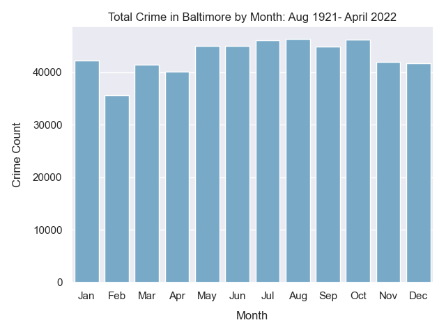
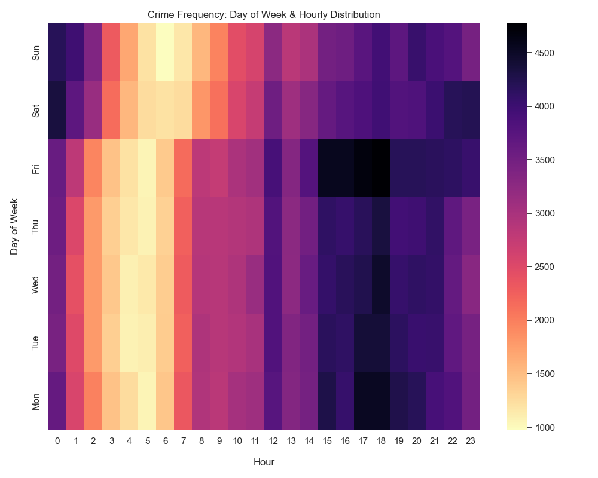
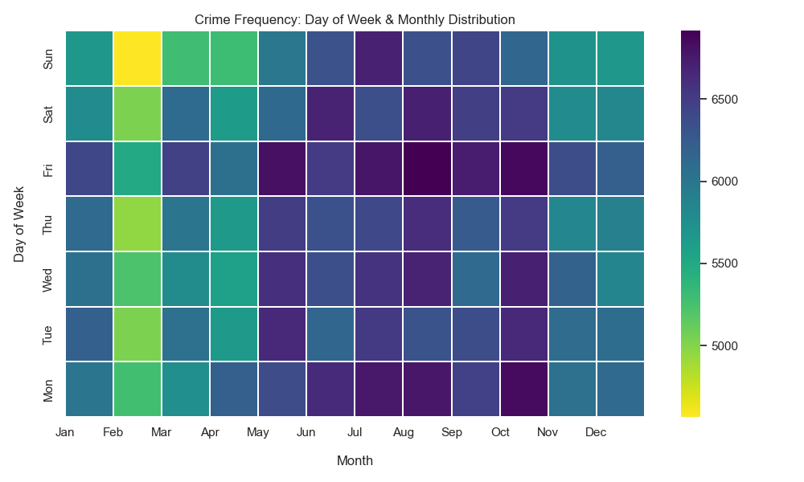
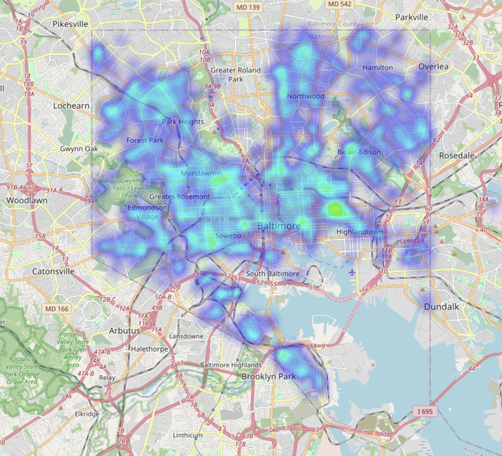

# baltimore_crime_analysis

I am using a public Kaggle dataset containing a century worth of Crime Data in Baltimore City!

As a resident, crime is hard to ignore and impacts life for me and many others, this inspired me to do analysis on the data :)

THIS WILL BE UPDATED FREQUENTLY AS I WORK ON IT

***

### IMPORT
```ruby
import os
import pandas as pd
import numpy as np
import matplotlib.pyplot as plt
import seaborn as sns
import folium
from folium.plugins import HeatMap
sns.set_theme()
```

### DATA CLEANING PROCESS
```ruby
missing_values_weapon = df["Weapon"].isnull()
missing_value_counter = 0

for i in range(516635):
    if missing_values_weapon[i]:
        missing_value_counter += 1

print(missing_value_counter)

# splitting DATE column to check years, months, and days for anomaly
data_parts = df['Date'].str.split("/", expand=True)

anomaly_year = 0
anomaly_month = 0
anomaly_day = 0

years = data_parts[0]
months = data_parts[1]
days = data_parts[2]

numbers_month = [str(i).zfill(2) for i in range(1, 13)]
numbers_day = [str(i).zfill(2) for i in range(1, 32)]

for year in years:
    if not (year.startswith("19") or year.startswith("20")):
        anomaly_year += 1

for month in months:
    if not (month in numbers_month):
        anomaly_month += 1

for day in days:
    if not (day in numbers_day):
        anomaly_day += 1

print("Number of anomalies in year: ", anomaly_year)
print("Number of anomalies in month: ", anomaly_month)
print("Number of anomalies in day: ", anomaly_day)
print()
```
Anomaly Report:

409,301 of the 516,635 WEAPON fields were blank, that is 79.26%!

Anomalies in year:  126 / Many of the years were formatted incorrectly (1024)

Anomalies in month:  0

Anomalies in day:  0

***

### CREATING THE DATAFRAME FOR FIRST VISULIZATION
```ruby
# converting the strings from date/time columns to usable objects
df['Date'] = pd.to_datetime(df['Date'])
df['Time'] = pd.to_datetime(df['Time'])

# Create the DataFrame with the top 10 most frequent dates and their counts
df['Month'] = df['Date'].dt.month
top_dates = df['Month'].value_counts().head(12)
top_dates_df = top_dates.reset_index()
top_dates_df.columns = ['Month', 'Count']

# Create a bar plot using Matplotlib
sns.barplot(x='Month', y='Count', hue=False, data=top_dates_df, palette='Blues', legend=False)
plt.title('Total Crime in Baltimore by Month: Aug 1921- April 2022')
plt.xlabel('Month', labelpad=10)
plt.ylabel('Crime Count', labelpad=10)

months_order = ['Jan', 'Feb', 'Mar', 'Apr', 'May', 'Jun', 'Jul', 'Aug', 'Sep', 'Oct', 'Nov', 'Dec']
plt.xticks(ticks=range(12), labels=months_order)

# Rotate the x-axis labels for better readability
plt.xticks(rotation=0)

# Show the plot
plt.tight_layout()
plt.show()
```


*(Fig 1) Crime remains relatively consistent throughout the year with the exception of a drop in February, which follows a gradual rise, with the peak of crime being in August.*


### CREATING THE DATAFRAME FOR OUR HEATMAPS
```ruby
date = df['Date'].iloc[0]
time = df['Time'].iloc[0]

df['Hour'] = df['Time'].apply(lambda time: time.hour)
df['Month'] = df['Date'].apply(lambda date: date.month)
df['Year'] = df['Date'].apply(lambda date: date.year)
df['Day of Week'] = df['Date'].apply(lambda date: date.dayofweek)

# Set the order of the days of the week based off their integer value
day_order = [6, 5, 4, 3, 2, 1, 0]

# Map integer value to their corresponding day
df_map = {0: 'Mon', 1: 'Tue', 2: 'Wed', 3: 'Thu', 4: 'Fri', 5: 'Sat', 6: 'Sun'}

# By default, days are out of order as they are in the DF, orders it to day_order
df['Day of Week'] = pd.Categorical(df['Day of Week'], categories=day_order, ordered=True)
df['Day of Week'] = df['Day of Week'].map(df_map)

dayHour = df.groupby(by=['Day of Week', 'Hour'], observed=False).count()['RowID'].unstack()
print(dayHour.head())

fig, ax = plt.subplots(figsize=(10, 8))
plt.xlabel('Hour', labelpad=15)
plt.ylabel('Day of Week', labelpad=15)
plt.xticks(rotation=0)

# creates heatmap
sns.heatmap(dayHour, cmap='magma_r')
plt.title("Crime Frequency: Day of Week & Hourly Distribution")

plt.tight_layout()
plt.show()

# heat map settings for crime frequency on day of week / month
dayMonth = df.groupby(by=['Day of Week', 'Month'], observed=False).count()['RowID'].unstack()
print(dayMonth.head())
fig1, ax1 = plt.subplots(figsize=(10, 6))
plt.xlabel('Month', labelpad=15)
plt.ylabel('Day of Week', labelpad=15)
plt.xticks(rotation=0)

# creates heatmap
sns.heatmap(dayMonth, cmap='viridis_r', linewidths=0.3)
plt.xticks(ticks=range(12), labels=months_order)
plt.title("Crime Frequency: Day of Week & Monthly Distribution")
plt.tight_layout()
plt.show()
```


*(Fig 1) Heatmap of crime frequency based on day of week and hour of day. Everyday, crime count rises after 12PM and peaks from 3-5 PM. With the exception of Friday, Saturday, and Sunday nights where crime peaks through 12AM.*



***

### CREATING DATAFRAME FOR OUR LIVE HEATMAP

```ruby
df_map = df[pd.notnull(df['Latitude'])]
df_map = df[pd.notnull(df['Longitude'])]

df_map['Latitude'].median()
df_map['Longitude'].median()


def generateBaseMap(default_location=[39.30364, -76.6139599], default_zoom_start=12):
    base_map = folium.Map(location=default_location, control_scale=True, zoom_start=default_zoom_start)
    return base_map


base_map = generateBaseMap()

df_map['count'] = 1
df_murder = df_map[df_map['Description'] == 'SHOOTING']

HeatMap(
    data=df_murder[['Latitude', 'Longitude', 'count']].groupby(
        ['Latitude', 'Longitude']).sum().reset_index().values.tolist(),
    radius=8,
    max_zoom=13).add_to(base_map)

base_map.save("map.html")
```



